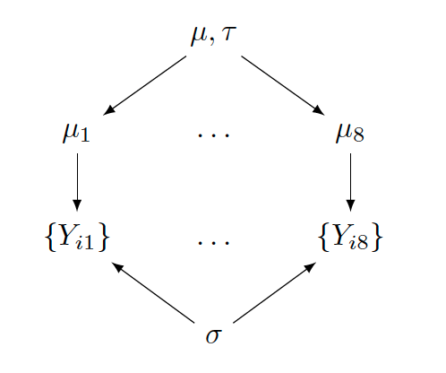

```{r setup, include=FALSE}
knitr::opts_chunk$set(echo = TRUE,
                      warning = FALSE,
                      message = FALSE)
```

```{r}
library(tidyverse)
```

# Example 1: Regressions - Bayesian vs classical

## The data: The Consumer Expenditure Surveys (CE)

The CE sample comes from the 2019 Q1 CE PUMD: 5 variables, 5133 consumer units (CU).

Variable \& Description:

- **UrbanRural**: Binary; the urban / rural status of CU: 1 = Urban, 2 = Rural.

- **Income**: Continuous; the amount of CU income before taxes in past 12 months (in $USD$).

- **Race**: Categorical; the race category of the reference person: 1 = White, 2 = Black, 3 =                        Native American, 4 = Asian, 5 = Pacific Islander, 6 = Multi-race.

- **Expenditure**: Continuous; CU's total expenditures in last quarter (in $USD$).

- **KidsCount**: Count; the number of CU members under age 16. |

```{r}
CEdata <- readr::read_csv(file = "CEdata.csv")
CEdata[1:3, ]
```

## Simple linear regression

- **LogIncome**: predictor variable

- **LogExpenditure**: outcome variable

```{r}
CEdata$LogIncome <- log(CEdata$Income)
CEdata$LogExpenditure <- log(CEdata$Expenditure)
```

### Highlights in teaching

- This is a multi-parameter model

- The Bayesian inference framework:
    - parameters are random variables with distributions that quantify degree of uncertainty
    - posterior is proportional to likelihood times prior
    
- Markov chain Monte Carlo (MCMC) estimation: 
    - why
    - how
    
- MCMC diagnostics
    - why
    - how
    
- Inference
    - credible intervals vs confidence intervals, hypothesis testing
    - prediction
    - model checking
    - evaluating prior choices
    - comparison to classical inference


### Bayesian inference with the brms package

```{r}
# make sure to install and load the library
library(brms)
```

#### The model and Bayesian inference framework

\begin{eqnarray}
Y_i \mid \mu_i, \sigma &\overset{ind}{\sim}& \textrm{Normal}(\mu_i, \sigma), \\
\mu_i &=& \beta_0 + \beta_1 x_i.
\end{eqnarray}

- Model parameters: $\{\beta_0, \beta_1, \sigma\}$

- Bayesian inference: 
    - Prior for $\{\beta_0, \beta_1, \sigma\}$
    - Sampling model for $Y_1, \cdots, Y_n \mid \mu_i, \sigma$
    - Posterior for $\{\beta_0, \beta_1, \sigma\}$
    
#### Choosing a prior

Check the default prior provided by the ```brms``` package.

```{r}
brms::get_prior(data = CEdata,
                family = gaussian,
                formula = LogExpenditure ~ 1 + LogIncome)
```

One can also use one's own priors, e.g., using the following in the ```brm()``` function.

```{r, eval = FALSE}
prior = c(prior(normal(0, 10), class = Intercept),
          prior(normal(0, 10), class = b),
          prior(cauchy(0, 1), class = sigma))
```

#### MCMC estimation

```{r results = 'hide'}
SLR_Bayes_fit <- brms::brm(data = CEdata,
                           family = gaussian,
                           formula = LogExpenditure ~ 1 + LogIncome,
                           iter = 5000,
                           warmup = 3000,
                           thin = 1,
                           chains = 1,
                           seed = 720)
```

#### MCMC diagnostics

```{r fig.height = 3, fig.width = 6, fig.align = "center"}
library(bayesplot)
bayesplot::mcmc_trace(x = SLR_Bayes_fit,
                      pars = c("b_Intercept", "b_LogIncome", "sigma"))
bayesplot::mcmc_acf(x = SLR_Bayes_fit,
                    pars = c("b_Intercept", "b_LogIncome", "sigma"))
```

#### Posterior inference

```{r fig.height = 3, fig.width = 6, fig.align = "center"}
post_SLR <- brms::posterior_samples(x = SLR_Bayes_fit)
bayesplot::mcmc_areas(post_SLR, pars = "b_LogIncome", prob = 0.95)
```

```{r}
quantile(post_SLR$b_LogIncome, c(0.025, 0.975))
```

A 95\% **credible interval** for the slope of LogIncome is [0.34, 0.37].

```{r}
summary(SLR_Bayes_fit)
```

Additional inference:

- **Prediction**: ```predict(fit)```

- **Model checking (posterior predictive check)**: ```pp_check(fit)```

- Evaluation of prior choices

### Classical inference with the lm package

```{r}
SLR_classical_fit <- lm(formula = LogExpenditure ~ 1 + LogIncome,
                        data = CEdata)

summary(SLR_classical_fit)
```

```{r}
confint.default(SLR_classical_fit)
```

A 95\% **confidence interval** of the slope of LogIncome is [0.34, 0.37].

#### Sample script for multiple linear regression

- Own prior choice

```{r, eval = FALSE}
MLR_Bayes_fit_1 <- brm(data = CEdata,
                       family = gaussian,
                       formula = LogExpenditure ~ 1 + LogIncome + as.factor(UrbanRural),
                       prior = c(prior(normal(0, 10), class = Intercept),
                                 prior(normal(0, 10), class = b),
                                 prior(cauchy(0, 1), class = sigma)),
                       iter = 5000,
                       warmup = 3000,
                       thin = 1,
                       chains = 1,
                       seed = 129)
```

- Default prior choice

```{r, eval = FALSE}
MLR_Bayes_fit_2 <- brm(data = CEdata,
                       family = gaussian,
                       formula = LogExpenditure ~ 1 + LogIncome + as.factor(UrbanRural),
                       iter = 5000,
                       warmup = 3000,
                       thin = 1,
                       chains = 1,
                       seed = 129)
```

## Logistic regression

- **LogExpenditure**: predictor variable

- **UrbanRural**: outcome variable (minus 1)

### Bayesian inference with the brms package

#### Choosing a prior

Check the default prior provided by the ```brms``` package.

```{r}
brms::get_prior(data = CEdata,
                family = binomial(link = "logit"),
                formula = (UrbanRural - 1) ~ 1 + LogExpenditure)
```

One can also use one's own priors.

#### MCMC estimation

```{r results = 'hide'}
logistic_Bayes_fit <- brms::brm(data = CEdata,
                                family = binomial(link = "logit"),
                                formula = (UrbanRural - 1) ~ 1 + LogExpenditure,
                                iter = 5000,
                                warmup = 3000,
                                thin = 1,
                                chains = 1,
                                seed = 257)
```

#### MCMC diagnostics

Sample script:

```{r eval = FALSE}
bayesplot::mcmc_trace(x = logistic_Bayes_fit,
                      pars = c("b_Intercept", "b_LogExpenditure"))
bayesplot::mcmc_acf(x = logistic_Bayes_fit,
                    pars = c("b_Intercept", "b_LogExpenditure"))
```

#### Posterior inference

```{r fig.height = 3, fig.width = 6, fig.align = "center"}
post_logistic <- brms::posterior_samples(x = logistic_Bayes_fit)
bayesplot::mcmc_areas(post_logistic, pars = "b_LogExpenditure", prob = 0.95)
```


```{r}
quantile(post_logistic$b_LogExpenditure, c(0.025, 0.975))
```

A 95\% **credible interval** for the slope of LogExpenditure is [-0.45, -0.22].

```{r}
summary(logistic_Bayes_fit)
```

Additional inference:

- **Prediction**: ```predict(fit)```

- **Model checking (posterior predictive check)**: ```pp_check(fit)```

- Evaluation of prior choices

### Classical inference with the glm package

```{r}
logistic_classical_fit <- glm(formula =  (UrbanRural - 1) ~ 1 + LogExpenditure,
                              family = binomial(link = "logit"),
                              data = CEdata)

summary(logistic_classical_fit)
```

```{r}
confint.default(logistic_classical_fit)
```

A 95\% **confidence interval** of the slope of LogExpenditure is [-0.45, -0.21].


## Multinomial logistic regression

- **LogIncome**: predictor variable

- **Race**: outcome variable

### Bayesian inference sample script with default priors

```{r eval = FALSE}
multi_logistic_Bayes_fit <- brms::brm(data = CEdata,
                                      family = categorical(link = "logit"),
                                      Race ~ 1 + LogIncome,
                                      iter = 5000,
                                      warmup = 3000,
                                      thin = 1,
                                      chains = 1,
                                      seed = 843)
```

### Classical inference with the nnet package

```{r eval = FALSE}
library(nnet)
multi_logistic_classical_fit <- nnet::multinom(formula =  Race ~ 1 + LogIncome,
                                               data = CEdata)
```

## Poisson regression

- **LogIncome** \& **LogExpenditure**: predictor variables

- **KidsCount**: outcome variable

### Bayesian inference sample script with default priors

```{r eval = FALSE}
Poisson_Bayes_fit <- brms::brm(data = CEdata,
                               family = poisson(link = "log"),
                               formula = KidsCount ~ 1 + LogIncome + LogExpenditure,
                               iter = 5000,
                               warmup = 3000,
                               thin = 1,
                               chains = 1,
                               seed = 853)
```

### Classical inference with the glm package

```{r eval = FALSE}
Poisson_classical_fit <- glm(formula =  KidsCount ~ 1 + LogIncome + LogExpenditure,
                             family = poisson(link = "log"),
                             data = CEdata)
```


# Example 2: Hierarchical models

## The data: The animation movie ratings from 2010

Sample from MovieLens; 8 animation movies with 55 ratings. Each rating is for a movie completed by a user; some movies have many ratings while others have few (fewest: only 1 rating).

- **Title**: movie title

- **Rating**: movie rating by a user


```{r fig.height = 3, fig.width = 6, fig.align = "center", size = "footnotesize", echo = FALSE}
MovieRatings = read.csv("2010_animation_ratings.csv", header = TRUE, sep = ",")

MovieRatings %>%
  mutate(Title = as.character(title),
         Title = recode(Title,
                  "Shrek Forever After (a.k.a. Shrek: The Final Chapter) (2010)" = "Shrek Forever",
                  "How to Train Your Dragon (2010)" = "Dragon",
                  "Toy Story 3 (2010)" = "Toy Story 3",
                  "Tangled (2010)" = "Tangled",
                  "Despicable Me (2010)" = "Despicable Me",
                  "Legend of the Guardians: The Owls of Ga'Hoole (2010)" = "Guardians",
                  "Megamind (2010)" = "Megamind",
                  "Batman: Under the Red Hood (2010)" = "Batman")) ->
           MovieRatings

ggplot(MovieRatings, aes(Title, rating)) +
  geom_jitter(width = 0.2,
              size = 1) +
  coord_flip() +
  ylab("Rating") + 
  theme_bw(base_size = 10, base_family = "")
```

## Highlights in teaching

- Bayesian approaches are natural for observations nested in groups

- Using 2 or more MCMC chains
    - diagnostics
    - inference
    
- Inference
    - credible intervals vs confidence intervals, hypothesis testing
    - prediction
    - model checking
    - evaluating prior choices
    
- Additional inference
    - shrinkage / pooling effects
    - sources of variability


## A hierarchical / multi-level model 

### The sampling model

- Without loss of generality, assume a group-specific normal model for movie $j$:
\begin{eqnarray}
Y_{ij} \overset{i.i.d.}{\sim} \textrm{Normal}(\mu_j, \sigma),
\end{eqnarray}
where $i = 1, \cdots, n_j$ and $n_j$ is the number of observations in group $j$. 

- Is a commonly shared $\sigma$ reasonable? If not, $\sigma$ can be group-specific.

- Model parameters: $\{\mu_1, \cdots, \mu_J, \sigma\}$.

### A two-stage prior for $\{\mu_1, \cdots, \mu_J\}$

**Stage 1**

- All movies are animation movies, we could assume that the mean ratings are similar across movies

- First stage: the same normal prior distribution for each mean $\mu_j$
\begin{equation}
\mu_j \mid \mu, \tau \sim \textrm{Normal}(\mu, \tau).
\end{equation}

- This prior allows information pooled across movies (groups).
    - If $\tau$ is large, the $\mu_j$'s are very different a priori $\rightarrow$ modest pooling in parameter estimation.
    - If $\tau$ is small, the $\mu_j$'s are very similar a priori $\rightarrow$ large pooling in parameter estimation.

- $\mu$ and $\tau$: hyperparameters, and treated random.

**Stage 2**

- Second stage: weakly informative hyperpriors for hyperparameters
\begin{eqnarray}
\mu &\sim& \textrm{Normal}(3, 1), \\
\tau &\sim& \textrm{Cauchy}(0, 1).
\end{eqnarray}

- After posterior inference:
    - The posterior of $\mu$ is informative about an average mean rating.
    - The posterior of $\tau$ is informative about the variation among the $\mu_j$'s.

**Others**

- Weakly informative prior for $\sigma$:
\begin{eqnarray}
\sigma &\sim& \textrm{Cauchy}(0, 1).
\end{eqnarray}

```{r  echo = FALSE, fig.height = 3, fig.width = 6, fig.align = "center"}

```

## Bayesian inference with the brms package

### MCMC estimation

Use chosen priors; one can also use default priors.

```{r, results = 'hide'}
library(brms)
hm_fit <- brms::brm(data = MovieRatings,
                    family = gaussian,
                    formula = rating ~ 1 + (1 | Title),
                    prior = c(prior(normal(3, 1), class = Intercept),
                              prior(cauchy(0, 1), class = sd),
                              prior(cauchy(0, 1), class = sigma)),
                    iter = 20000, 
                    warmup = 10000, 
                    thin = 10, 
                    chains = 2, 
                    seed = 852)
```

### MCMC diagnostics

```{r fig.height = 3, fig.width = 6, fig.align = "center"}
library(bayesplot)
bayesplot::mcmc_trace(x = hm_fit,
                      pars = c("sd_Title__Intercept"))
bayesplot::mcmc_acf_bar(x = hm_fit,
                        pars = c("sd_Title__Intercept"))
```

### Posterior inference

```{r fig.height = 3, fig.width = 6, fig.align = "center"}
post_hm <- posterior_samples(hm_fit)
bayesplot::mcmc_areas(x = post_hm, 
                      pars = c("b_Intercept", "r_Title[Batman,Intercept]"),
                      prob = 0.95)
```

```{r fig.height = 3, fig.width = 6, fig.align = "center"}
bayesplot::mcmc_areas(x = post_hm, 
                      pars = c("b_Intercept", 
                               "r_Title[Batman,Intercept]", 
                               "r_Title[Despicable.Me,Intercept]", 
                               "r_Title[Dragon,Intercept]",
                               "r_Title[Guardians,Intercept]",
                               "r_Title[Megamind,Intercept]",
                               "r_Title[Shrek.Forever,Intercept]",
                               "r_Title[Tangled,Intercept]",
                               "r_Title[Toy.Story.3,Intercept]"), 
                      prob = 0.95)
```


Additional inference:

- **Prediction**: ```predict(fit)```

- **Model checking (posterior predictive check)**: ```pp_check(fit)```

- **Shrinkage / pooling effects**:

```{r fig.height = 3, fig.width = 6, fig.align = "center", echo = FALSE}
J <- 8
Post_Mus <- post_hm[, 1] + post_hm[, 4:11]
Post_Means <- colMeans(Post_Mus)

MovieRatings %>% group_by(Group_Number) %>%
  summarize(Title = first(title),
            N = n(), M = mean(rating),
            SE = sd(rating) / sqrt(N)) -> Ind_Stats

Means1 <- data.frame(Type = "Sample", Mean = Ind_Stats$M)
Means2 <- data.frame(Type = "Posterior", Mean = Post_Means)
Means1$Title <- c("Dragon", "Toy Story 3", "Shrek Forever",
                  "Despicable Me", "Batman", "Guardians",
                  "Megamind", "Tangled")
Means2$Title <- c("Batman", "Despicable Me", "Dragon", "Guardians",
                  "Megamind", "Shrek Forever",
                   "Tangled", "Toy Story 3")
df <- rbind(Means1, Means2)
df$Type <- factor(df$Type, levels = c("Sample", "Posterior"))
ggplot(df,
       aes(Type, Mean, group=Title)) +
  geom_line() + geom_point() +
  annotate(geom = "text",
           x = 0.75,
           y = Means1$Mean + c(0.05, 0, 0.05, 0,
                               0, -0.05, 0, 0),
           size = 2,
           label = Means1$Title) +
  theme_bw(base_size = 15, base_family = "")
```

- **Sources of variability**:

- Two sources of variability in $Y_{ij}$:
\begin{eqnarray*}
Y_{ij} &\overset{i.i.d.}{\sim}& \textrm{Normal}(\mu, \sigma) \,\,\, \text{[within-group variability]} \\
\mu_j &\sim& \textrm{Normal}(\mu, \tau) \,\,\, \text{[between-group variability]}
\end{eqnarray*}

- To compare these two sources of variability, one can compute the fraction
\begin{equation*}
R = \frac{\tau^2}{\tau^2 + \sigma^2}
\end{equation*}
from the posterior draws of $\tau$ and $\sigma$.

- If $R \rightarrow 1$, the higher the between-group variability.

```{r fig.height = 2, fig.width = 6, fig.align = "center"}
tau_draws <- post_hm[,"sd_Title__Intercept"]
sigma_draws <- post_hm[,"sigma"]
R <- tau_draws^2/(tau_draws^2 + sigma_draws^2)
quantile(R, c(0.025, 0.975))
```


```{r fig.height = 2, fig.width = 6, fig.align = "center", echo = FALSE}
df <- as.data.frame(R)
ggplot(df, aes(x=R)) + 
  geom_density() + 
  labs(title="Density of R") + 
  theme_bw(base_size = 15, base_family = "")
```

```{r fig.height = 3, fig.width = 6, fig.align = "center"}
bayesplot::mcmc_areas(x = post_hm, 
                      pars = c("sd_Title__Intercept", "sigma"),
                      prob = 0.95)
```